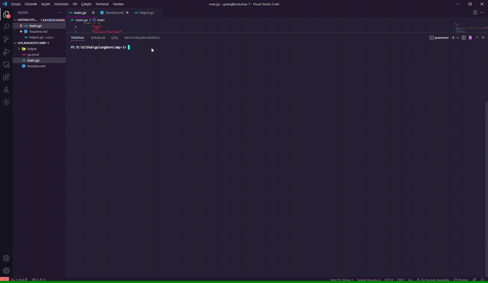

# GO KİTAP ARAMA ve LİSTELEME UYGULAMASI
Bu uygulama Patika ve Picus Security iş birliğinde gerçekleşen Golang Backend Web Development Bootcamp kapsamındaki ilk ödevi içermektedir.  
> Projenin çalışırlığına [Uygulama Çıktısı](#uygulama-%C3%A7%C4%B1kt%C4%B1s%C4%B1)'ndan ulaşabilirsiniz.  

<br>  
<br>  

# İçindekiler
- [Uygulama İsterleri](#uygulama-i%CC%87sterleri)  
- [Uygulama Öncesi Hazırlık](#uygulama-%C3%B6ncesi-haz%C4%B1rl%C4%B1k)  
- [Uygulama Aşamaları](#uygulama-a%C5%9Famalar%C4%B1)  
- [Uygulama Çıktısı](#uygulama-%C3%A7%C4%B1kt%C4%B1s%C4%B1)  


<br>  
<br>  

# Uygulama İsterleri
- Kullanıcı yapmak istediği işlemleri `list`ve `search` komutlarını kullanarak belirtecek.  
- Kullanıcı bir argüman belirtmezse, kullanıcıya kullanabileceği argümanları belirtilmesi gerekli.  
- Uygulama içinde, önceden tanımlanan `slice`değişeni içerisine 3-5 veri eklenmiş olmalı. Kullanıcı `list` argümanını kullandığında önceden eklenen bu verilerin listelenmesi gerekir.  
- Kullanıcı `search`argümanını kullanırsa ve ardından herhangi bir değer girmezse kullanıcıya **"Arama Yapınız!"** benzeri bir cevap döndürülmeli. Aynı şekilde kullanıcı `search`yazıp bir değer girerse ilgili değeri içeren kitabı ya da kitapları listelemeniz gerekli.  
- *Komutlar:*  
	+ **search:** Arama yapmak için kullanılacak bu komuttan sonraki gelen argümanlar birleştirilerek arama yaparken kullanılacak değeri içermelidir.  
	> örn: search star wars  
	+ **list:** Ekli olan kitapları listelemek için kullanılmalıdır.  

<br>  
<br>  

# Uygulama Öncesi Hazırlık

- **Proje içerisinde kullanılan yapılar/fonkiyonlar:** if/else, for-range, slice, 
- **Proje içeriğinde kullanılan paketler:** `strigs`, `os`, `ftm`, `helper`(kendi oluşturduğum paket) 


<br>  
<br>  

# Uygulama Aşamaları

Bu projede komut satırına girilen verileri okuyup girdiye göre kitapların listelenmesi (list) ve aranması (search) işlemlerini gerçekleştirdim.

```
bookSlice := []string{"Pale Fire", "Antigone", "As I Lay Dying", "The Color Purple", "The Possessed", "Gone With the Wind", "Lord of the Flies"}


	args := os.Args


	firstArg := helper.Lowercase(args[1])

```

- Öncelikle bir slice oluşturdum ve bazı değerler atadım.

- Sonrasında **os** kullanarak komut satırına yazılan verileri bir değişkene atadım

- İlk yazılan projenin ismi olduğu için ikinci değişkeni firstArg olarak aldım. Bu değişken ile **list** veya **search** işlemlerinden hangisinin yapıldığını kontrol ettim.

<br>

```
package helper

import (
	"strings"
)

func Lowercase(x string) string {

	var str string

	str = strings.ToLower(x)

	return str

}
```

- Burada kendi oluşturduğum paket olan helper içindeki Lowercase methodu ile alınan veriyi küçük harf ile yazdırdım.

<br>  

```
if len(args) == 1 || (firstArg != "list" && firstArg != "search") {

		fmt.Println("Please enter 'search' <Book_name> or 'list' ")

	} else {

		if firstArg == "list" {

			for i := 0; i < len(bookSlice); i++ {

				fmt.Println(bookSlice[i])
			}

		}

		if firstArg == "search" {

			// get book name

			secondArg := strings.Join(args[2:], " ")

			secondArg = helper.Lowercase(secondArg)

			var result bool = false

			for _, v := range bookSlice {

				if helper.Lowercase(v) == secondArg {
					result = true
					break
				}

			}

			if result {
				fmt.Printf("Book Found: %v", secondArg)
			} else {
				fmt.Printf("Book did not Found: %v", secondArg)

			}
		}

	}

```

- Yukarı ise öncellikle işlemin **search** veya **list**'te olmaması durumunda kullancıya bir mesaj döndürmek için *if* kontrolü kullandım.

<br>

- Ardından *else* durumu için tekrardan if kontrolü kullanarak yapılmak istenilen işlemin **search** veya **list** olmasına göre işlemler gerçekletirdim.

<br>

- Eğer işlem **list** ise *for* döngüsü ile *slice* içinde bulunan bütün değerli yazdırdım.

<br>

- Eğer işlem **search** ise 2. girilen değerden sonrasını alıp **Join** ile *string* formatına çevirdim. 
- Ardından aranan kitap isminin eşleşmesi durumunda kullanmak için bir *boolean* değişken tanımladım. Arama yapabilmek için slice içinde bulunan bütün değeri gezerek komut satırına girilen kitap ismi ile karşılaştırma yaptım eğer kitap bulunursa **false** olan boolean değişkeni **true** yaptım. 
	+ Bu işlemlerin sonucunda boolean değişkeni **true** ise kitabın bulunduğunu; **false** ise bulunamadığını yazdıran bir *if/else* koşulu kullandım.  

<br>  
<br>  


# Uygulama Çıktısı
Aşağıda uygulamanın çalışırlığını gözlemleyebilirsiniz.

<br>

  

